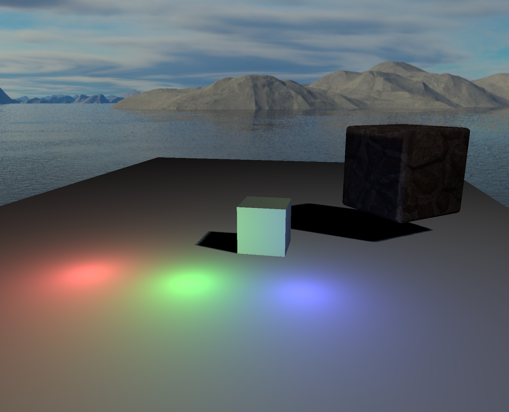
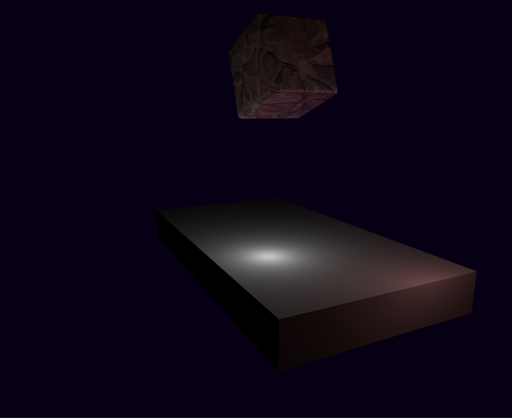

# Zero
Zero is a basic rendering engine

## Usage
Example scene can be found in [bin](/bin)

To launch it run
```
cargo run --release --bin example_scene
```
## Libraries Used
Main libraries on which Zero relies on:
- [wgpu](https://github.com/gfx-rs/wgpu/tree/v0.12): modern / low-level / cross-platform graphics library inspired by Vulkan
- [winit](https://github.com/rust-windowing/winit): Cross-platform window creation and management in Rust
- [cgmath](https://github.com/rustgd/cgmath): A linear algebra and mathematics library for computer graphics

## Examples


